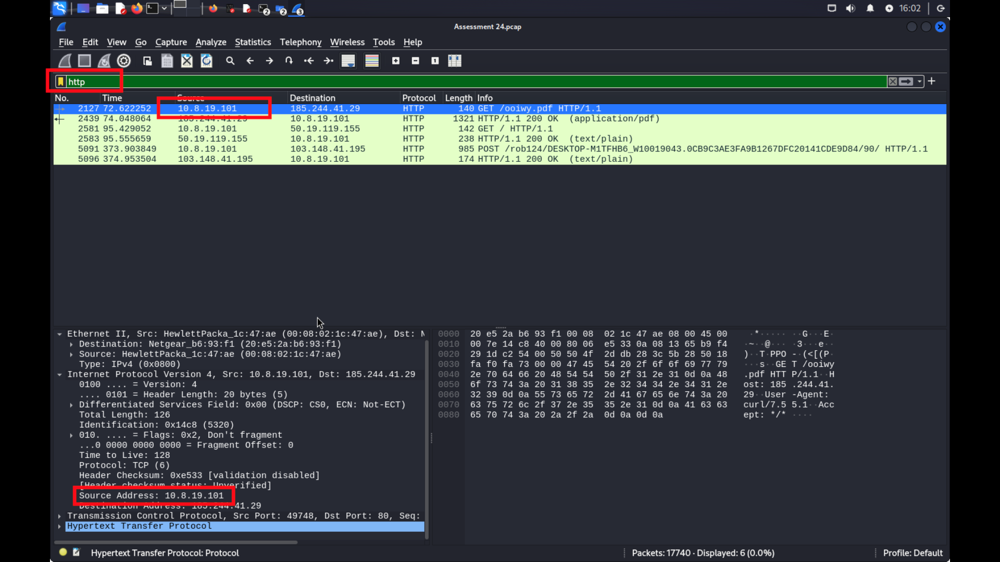
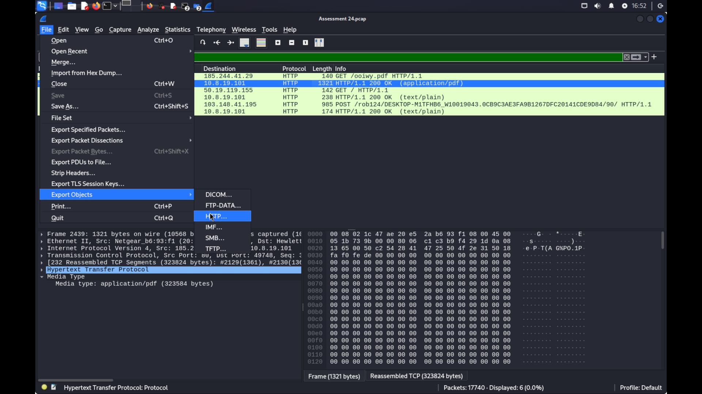
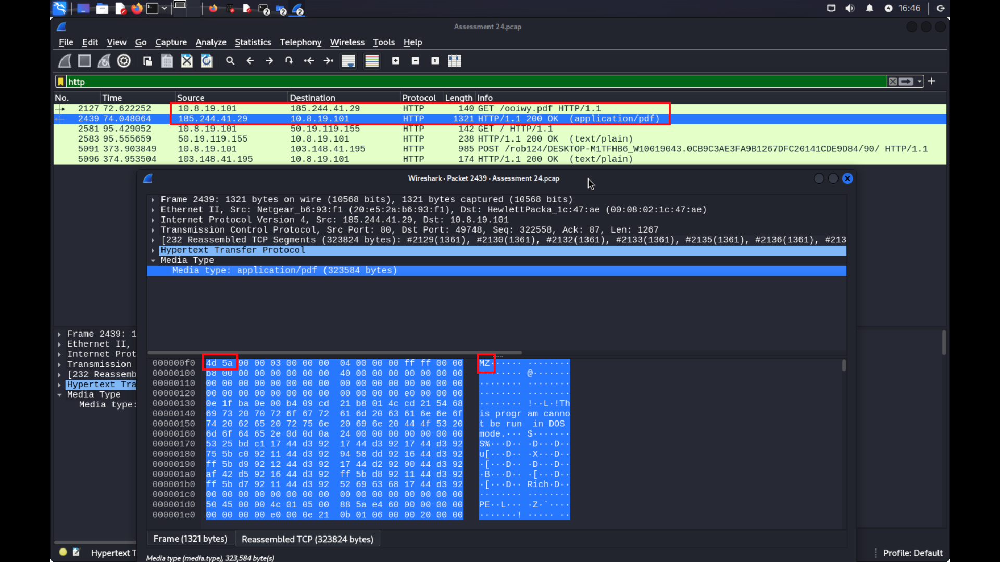
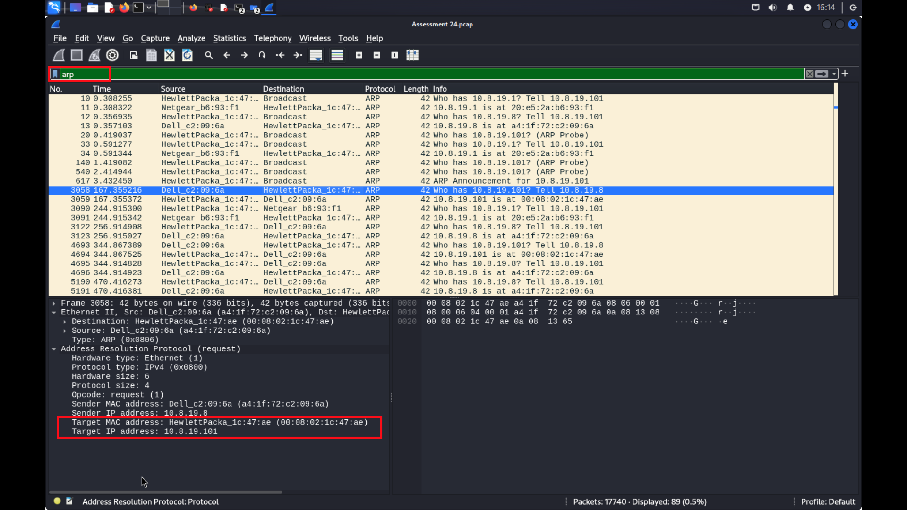
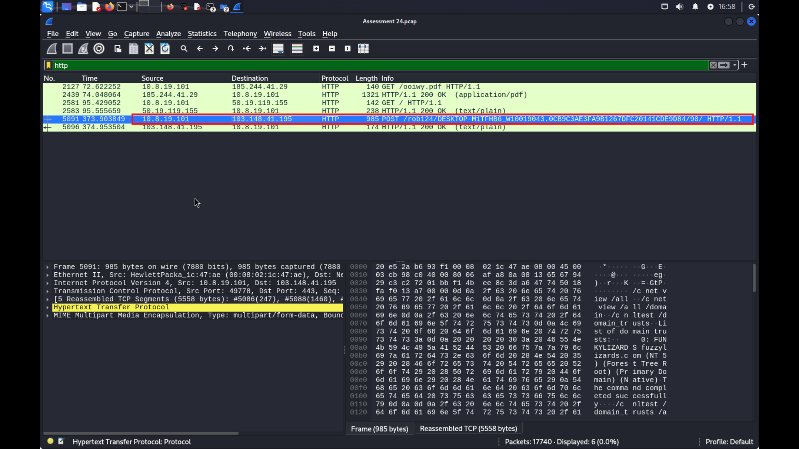
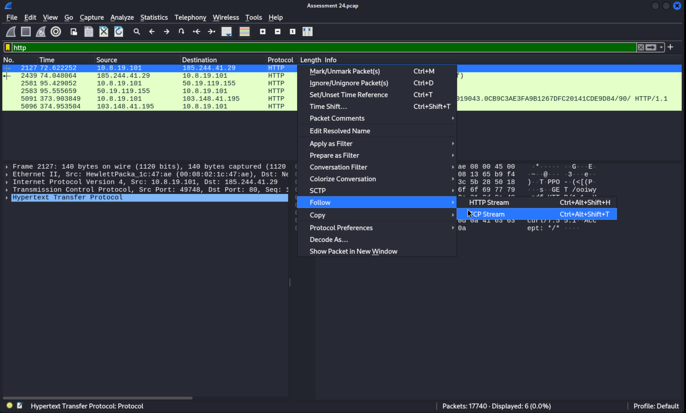

# SOC Incident Investigation — TrickBot Malware via PCAP Network Traffic Analysis


---

## Project Overview

This project documents a full end-to-end SOC incident investigation conducted on a suspicious network traffic capture (PCAP file). The investigation simulates the workflow of a real Security Operations Centre analyst responding to an alert about unusual outbound network behaviour from an internal Windows workstation.

Using packet-level analysis in Wireshark, the investigation reconstructed the full attack chain — from initial malware delivery through HTTP, through file signature verification, to confirmed Command and Control (C2) communication with an external attacker-controlled server.

The malicious file (`ooiwy.pdf`) was identified as a disguised Windows DLL payload belonging to the **TrickBot** trojan family. All indicators of compromise (IOCs) were extracted, documented, and are included in this repository.

This repository is structured to reflect real SOC case documentation standards, including an investigation timeline, extracted IOCs, PCAP evidence, analytical queries, and a full written incident report.

---

## Detection Context

This investigation simulates how a Security Operations Centre (SOC) analyst would investigate suspicious network activity detected within enterprise monitoring systems.

The activity analysed in this project could have been triggered by alerts such as:

- Suspicious HTTP download from an external IP
- Unexpected outbound network traffic from an internal workstation
- Possible command-and-control communication patterns
- File download with suspicious characteristics (non-browser User-Agent string)

In a real SOC environment, these indicators may be detected through:

- **Network Intrusion Detection Systems (NIDS)** flagging outbound connections to known malicious IPs
- **Endpoint Detection and Response (EDR) alerts** on unusual process activity or DLL execution
- **Security Information and Event Management (SIEM) rules** triggering on `curl`-based downloads from workstations or anomalous outbound POST requests
- **Network traffic anomaly detection** identifying internal hosts communicating with previously unseen external IPs over standard HTTP

---

## Investigation Objectives

The investigation aimed to:

- Identify the affected host within the network (hostname, IP, MAC address, and user account)
- Determine how the malicious file was delivered and by what mechanism
- Extract indicators of compromise (IOCs) for threat intelligence and detection enrichment
- Analyse potential command-and-control communication to understand attacker intent
- Document attacker behaviour observed in the PCAP and map it to the MITRE ATT&CK framework

---

## Tools Used

| Tool | Purpose |
|---|---|
| **Wireshark** | Primary PCAP analysis — display filtering, packet inspection, stream reconstruction |
| **GHex** | Binary hex editor — file signature verification of the extracted payload |
| **VirusTotal** | Threat intelligence — file hash reputation check and malware family identification |
| **TCP Stream Reconstruction** | Wireshark feature used to reassemble and read HTTP session content |
| **HTTP Object Extraction** | Wireshark feature used to export files transferred over HTTP within the capture |

---

## Investigation Workflow

### Step 1 — Identifying Suspicious HTTP Traffic

The investigation began by applying an `http` display filter in Wireshark to isolate all HTTP-layer communications within the PCAP.

A `GET` request was immediately identified originating from internal host `10.8.19.101` to the external IP `185.244.41.29`, requesting a file named `ooiwy.pdf`. Closer inspection of the HTTP request headers revealed a `User-Agent` string of `curl/7.55.1` — a significant red flag, as standard user activity from a workstation would present a browser User-Agent. The use of `curl` strongly indicates the download was triggered by a script, macro, or dropper component rather than a legitimate user action.


*Figure 1 — HTTP GET request from internal host `10.8.19.101` to external delivery server `185.244.41.29` requesting `ooiwy.pdf` with a `curl/7.55.1` User-Agent string*

---

### Step 2 — Extracting the Malicious File from the PCAP

With the suspicious file transfer confirmed, Wireshark's **Export HTTP Objects** function (`File > Export Objects > HTTP`) was used to extract all files transferred over HTTP within the PCAP session.

The file `ooiwy.pdf` was listed among the exported objects and was saved locally for further forensic examination. Extracting the file directly from the PCAP allowed for hash generation and signature analysis without relying on any potentially compromised endpoint.


*Figure 2 — Wireshark HTTP Object Export listing `ooiwy.pdf` transferred from the delivery server*

---

### Step 3 — Discovering the Executable Signature

The extracted file `ooiwy.pdf` was opened in **GHex** to inspect its binary header. Despite carrying a PDF extension, the first two bytes of the file read:

```
4D 5A
```

This is the **MZ magic number** — the Windows Portable Executable (PE) file signature, present in all Windows executables including `.exe`, `.dll`, and `.sys` files. The MZ initials refer to Mark Zbikowski, a developer of the MS-DOS executable format. The presence of this header in a file presented as a PDF is definitive proof of **extension spoofing**.

Further analysis confirmed the true file format was `ooiwdy.dll` — a Windows Dynamic Link Library. DLL files are commonly used by malware as payloads because they do not execute directly but are loaded by a host process, making detection harder.


*Figure 3 — GHex binary inspection confirming the `4D 5A` (MZ) PE header within the `ooiwy.pdf` file, revealing it as a disguised Windows DLL*

---

### Step 4 — Host Identification

To fully document the affected system, a series of Wireshark display filters were applied to extract all host-identifying information from the PCAP:

| Filter Applied | Information Recovered |
|---|---|
| `dhcp` | Hostname: `DESKTOP-M1TFHB6` (from DHCP REQUEST packet) |
| `smb` | Hostname confirmed via SMB session negotiation and NetBIOS name service |
| `http` | Internal IP confirmed: `10.8.19.101` |
| `arp` | MAC Address: `00-08-02-1C-47-AE` (ARP reply for `10.8.19.101`) |
| `ntlmssp` | User Account: `monica.steele` (NTLM authentication exchange) |

The ARP filter was particularly efficient for MAC address recovery — once the IP address was known, ARP broadcast replies in the PCAP directly mapped `10.8.19.101` to its physical hardware address. The NTLMSSP filter isolated Windows authentication packets which transmitted the username `monica.steele` in cleartext during a network authentication exchange.


*Figure 4 — ARP filter applied in Wireshark to map IP `10.8.19.101` to MAC address `00-08-02-1C-47-AE`, positively identifying the infected physical network interface*

---

### Step 5 — Command and Control Communication Analysis

Returning to the traffic logs, a `POST` request from the internal host (`10.8.19.101`) to a second, distinct external IP (`103.148.41.195`) was identified. This is a separate IP to the original delivery server, which is consistent with TrickBot's infrastructure model, where payload hosting and C2 operations are separated.

The POST request was followed and the response content confirmed that structured host data was being transmitted outbound — consistent with TrickBot's initial check-in behaviour, where the malware beacons to the C2 server and transmits system reconnaissance data including host details, user information, and network configuration.


*Figure 5 — HTTP POST request from `10.8.19.101` to C2 server `103.148.41.195`, confirming active malware communication with attacker infrastructure*

---

### Step 6 — TCP Stream Analysis

The full TCP stream for the C2 POST request was reconstructed using Wireshark's **Follow TCP Stream** function. The stream contents confirmed that the malware had transmitted victim system data to the attacker's C2 server in the POST body.

This stream reconstruction provided the clearest view of the data being exfiltrated and confirmed that the malware had successfully established a two-way communication channel with attacker-controlled infrastructure at the time the PCAP was captured.


*Figure 6 — TCP stream reconstruction of the C2 POST request, revealing victim system data transmitted from the infected host to `103.148.41.195`*

---

## Key Findings

| Finding | Detail |
|---|---|
| **Infected Host** | `DESKTOP-M1TFHB6` — IP `10.8.19.101` — MAC `00-08-02-1C-47-AE` |
| **Compromised Account** | `monica.steele` |
| **Malicious File Delivered** | `ooiwy.pdf` (true file: `ooiwdy.dll`) |
| **Delivery Server** | `185.244.41.29` — served payload via HTTP GET |
| **Delivery Mechanism** | `curl/7.55.1` — scripted download, not user-initiated browsing |
| **File Type Spoofing** | PE executable disguised with `.pdf` extension (MZ header: `4D 5A`) |
| **Malware Family** | TrickBot Trojan — confirmed via VirusTotal multi-engine scan |
| **C2 Server** | `103.148.41.195` — received POST beacon with victim system data |
| **C2 Protocol** | HTTP over port 80 |
| **Data Exfiltrated** | Host reconnaissance data (system info, user details) — confirmed via TCP stream |

---

## Indicators of Compromise

All extracted IOCs from this investigation are stored in the `iocs/` directory:

- **`iocs/IOC.txt`** — plaintext list of all indicators (IPs, hashes, filenames, user agent)
- **`iocs/IOC.csv`** — structured CSV format suitable for import into SIEM platforms, threat intelligence tools, or ticketing systems

### IOC Summary

| Type | Value |
|---|---|
| Internal Host IP | `10.8.19.101` |
| Hostname | `DESKTOP-M1TFHB6` |
| MAC Address | `00-08-02-1C-47-AE` |
| User Account | `monica.steele` |
| Malicious IP — Delivery | `185.244.41.29` |
| Malicious IP — C2 | `103.148.41.195` |
| Malicious Filename | `ooiwy.pdf` |
| True Filename | `ooiwdy.dll` |
| File Type | Windows DLL (PE) |
| File Signature | `4D 5A` (MZ header) |
| MD5 Hash | `4e4ae70b6346eae111e31716dc76bc23` |
| SHA-1 Hash | `1e7b9af799048e4112d2468323c5c147e20558f9` |
| SHA-256 Hash | `f25a780095730701efac67e9d5b84bc289afea56d96d8aff8a44af69ae606404` |
| Malware Family | TrickBot |
| Suspicious User-Agent | `curl/7.55.1` |

---

## PCAP Evidence File

The original network capture used in this investigation is included in the repository and can be opened directly in Wireshark to independently reproduce every finding documented here.

| Field | Details |
|---|---|
| **File** | `evidence/trickbot-infection-traffic.pcap` |
| **Size** | 15 MB |
| **Format** | Wireshark PCAP — microsecond timestamps, Ethernet capture |
| **Tool Required** | [Wireshark](https://www.wireshark.org/) (free) |
| **Purpose** | Reproduce the full investigation — apply the filters in `queries/wireshark-filters.md` to walk through the analysis step by step |

> ⚠️ **Note:** This PCAP contains network traffic associated with a TrickBot malware infection captured in a controlled academic environment. It is published for educational and cybersecurity research purposes only. Do not execute any extracted files outside of an isolated sandbox.

---

## Repository Structure

```
SOC-Incident-TrickBot/
│
├── case-study/               # Background context and scenario description for the investigation
│
├── screenshots/              # Annotated Wireshark screenshots taken during the investigation
│   ├── 01-malware-download-request.png
│   ├── 02-http-object-extraction.png
│   ├── 03-executable-signature.png
│   ├── 04-host-identification-mac.png
│   ├── 05-command-control-communication.png
│   └── 06-tcp-stream-analysis.png
│
├── evidence/                 # Raw PCAP capture file and extracted artefacts from the investigation
│   └── trickbot-infection-traffic.pcap   # ⚠️ Original network capture — open in Wireshark to reproduce findings
│
├── iocs/                     # Structured indicator of compromise files
│   ├── IOC.txt               # Plaintext IOC list
│   └── IOC.csv               # CSV-formatted IOC list for SIEM/tool import
│
├── timeline/                 # Reconstructed investigation timeline from PCAP timestamps
│
├── queries/                  # Wireshark display filters and detection queries used in the investigation
│
├── report/                   # Full written SOC incident investigation report (Markdown)
│   └── SOC-Incident-Investigation-Report-TrickBot.md
│
└── README.md                 # This file
```

---

## Skills Demonstrated

This investigation demonstrates practical, hands-on competency across the following cybersecurity domains:

| Skill Area | Application in This Investigation |
|---|---|
| **Network Traffic Analysis** | Applied Wireshark display filters (HTTP, DHCP, ARP, SMB, NTLMSSP) to systematically interrogate PCAP data |
| **Malware Investigation** | Identified TrickBot through file signature analysis, extension spoofing detection, and VirusTotal threat intelligence |
| **SOC Incident Response Methodology** | Followed a structured workflow — detection, triage, host identification, evidence collection, IOC extraction, containment |
| **Threat Detection** | Identified anomalous User-Agent strings, suspicious outbound connections, and C2 POST beacons |
| **IOC Extraction and Documentation** | Extracted and formatted IPs, file hashes, filenames, and host data for operational use |
| **TCP Stream Reconstruction** | Reassembled application-layer sessions to confirm data exfiltration content |
| **MITRE ATT&CK Framework Mapping** | Mapped observed attacker behaviours to relevant tactics and techniques (T1036, T1071.001, T1041, T1105, and others) |
| **Digital Forensics** | Used binary hex analysis (GHex) to verify file type independently of OS file extension handling |

---

## Disclaimer

This investigation was conducted entirely for **educational and cybersecurity research purposes**. The PCAP file analysed in this project was provided as part of academic coursework and contains pre-captured network traffic in a controlled environment.

No systems were compromised, no malware was deployed, and no unauthorised access was performed as part of this project. All analysis was performed in an isolated, safe environment. The malicious IP addresses and file hashes documented here are published solely as indicators of compromise to support threat detection and awareness.

---

*Investigation conducted by **Gbemisola Faith Akinlabi** | SOC Analyst*
*Tools: Wireshark · VirusTotal · GHex*
*Framework: MITRE ATT&CK*
